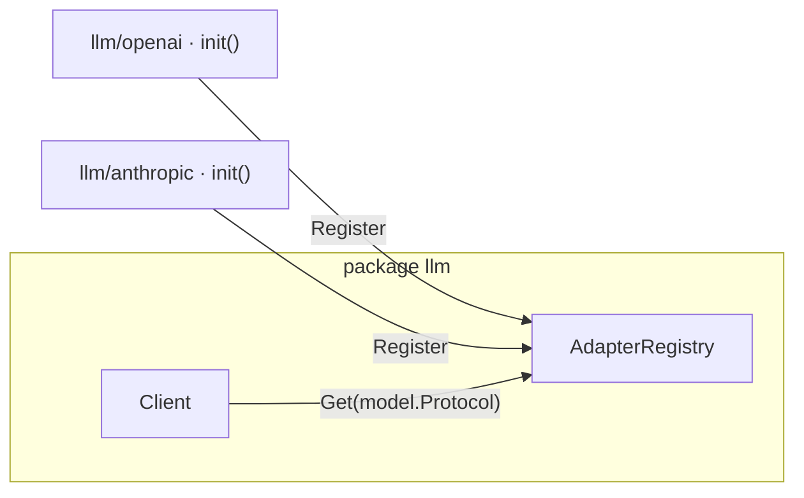
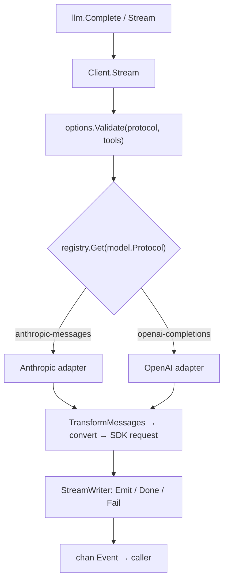

# Architecture overview

!!! note "About these pages"
    The Internals section walks through how the `llm` package works inside,
    for contributors and the curious. The public API is documented under
    [LLM](../llm/README.md); this section is about the implementation.

`or/llm` is a stateless translation layer. It decides what to send for one
request and how to interpret the streamed response, and leaves history storage,
context compaction, and tool-loop orchestration to the caller. The same
conversation can target any model on either wire protocol, and the target can
change between turns; the library re-adapts the history for each request.

## Package layout

There is no separate "facade" and "core": the public types and the
implementation live in one package, `llm`. Protocol adapters live in their own
sub-packages and register themselves on import, so an application links only the
vendor SDKs it actually uses.

| Path | Role |
|---|---|
| [`llm/`](https://github.com/ktsoator/or/tree/main/llm) | The whole neutral core and public API: models, messages, options, streaming, transform, the registry, and the default client |
| [`llm/openai/`](https://github.com/ktsoator/or/tree/main/llm/openai) | The `openai-completions` adapter; registers itself from `init` |
| [`llm/anthropic/`](https://github.com/ktsoator/or/tree/main/llm/anthropic) | The `anthropic-messages` adapter; registers itself from `init` |
| [`llm/all/`](https://github.com/ktsoator/or/tree/main/llm/all) | Blank-imports both adapters, for callers that want every built-in protocol |
| [`llm/internal/`](https://github.com/ktsoator/or/tree/main/llm/internal) | `jsonx` (lenient JSON helpers) and `genmodels` (the catalog generator) |

An adapter is pulled in for its side effects:

```go
import (
	"github.com/ktsoator/or/llm"
	_ "github.com/ktsoator/or/llm/anthropic" // registers anthropic-messages
)
```

## The registry, adapter, and client triad

Dispatch is built from three small pieces, all in the core package:

- **`ProtocolAdapter`** — an interface with `Protocol()` (its registry key) and
  `Stream()` (the request lifecycle for one protocol). See
  [adapters](adapters.md).
- **`AdapterRegistry`** — a concurrency-safe `map[Protocol]ProtocolAdapter`.
  Provider `init` functions call `llm.Register` to add themselves to the package
  default registry; a caller that prefers explicit wiring builds its own with
  `NewAdapterRegistry` and `AdapterRegistry.Register`.
- **`Client`** — holds a registry and routes each request to the adapter for the
  model's protocol. `llm.Stream` and `llm.Complete` are thin wrappers over a
  default client bound to the default registry.



## Request data flow



The `Protocol` field on the model is the discriminator: `Client.Stream` uses it
to pick an adapter from the registry. Everything left of the adapter is
provider-neutral; everything inside it may speak one concrete wire protocol.

## Reading a request end to end

```go linenums="1" hl_lines="9"
func (c *Client) Stream(ctx context.Context, model Model, input Context, options StreamOptions) (<-chan Event, error) {
	if c.registry == nil {
		return nil, errors.New("adapter registry is nil")
	}
	if err := options.Validate(model.Protocol, input.Tools); err != nil { // (1)!
		return nil, err
	}

	adapter, ok := c.registry.Get(model.Protocol) // (2)!
	if !ok {
		return nil, fmt.Errorf(
			"no adapter registered for protocol %q",
			model.Protocol,
		)
	}
	if strings.TrimSpace(options.APIKey) == "" {
		options.APIKey = GetEnvAPIKeyWithEnv(model.Provider, options.Env) // (3)!
	}

	return adapter.Stream(ctx, model, input, options)
}
```

1.  Protocol-specific options are checked against the target protocol before any
    HTTP request is built, so a mismatch fails fast.
2.  `Protocol` selects the adapter. The same conversation can target either
    protocol; the library re-adapts the history per request.
3.  The API key is resolved from the provider's environment variables only when
    the caller did not supply one.

Source: [`llm/client.go`](https://github.com/ktsoator/or/blob/main/llm/client.go),
[`llm/adapters.go`](https://github.com/ktsoator/or/blob/main/llm/adapters.go),
[`llm/default.go`](https://github.com/ktsoator/or/blob/main/llm/default.go).

## Where to go next

- [Models and protocols](models.md) — the `Model`, its capabilities, and the catalog.
- [Message types](messages.md) — the provider-neutral conversation model.
- [Protocol adapters](adapters.md) — how a protocol is translated and registered.
- [Streaming internals](streaming.md) — events and the `StreamWriter` machinery.
- [Switching models](transform.md) — adapting history with `TransformMessages`.
