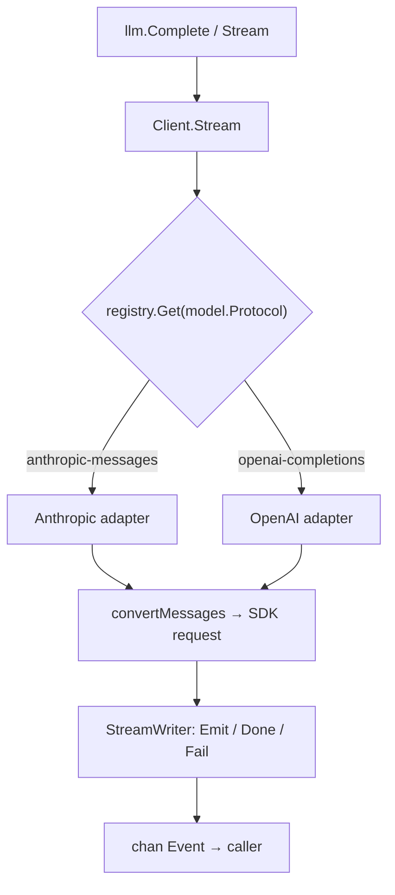

# Architecture overview

!!! note "About these pages"
    The Internals section walks through how the `llm` package works inside,
    for contributors and the curious. The public API is documented under
    [LLM](../llm/README.md); this section is about the implementation.

`or/llm` is a stateless translation layer. It decides what to send for one
request and how to interpret the streamed response, and leaves history storage,
context compaction, and tool-loop orchestration to the caller.

## Two layers

| Layer | Location | Responsibility |
|---|---|---|
| Public facade | [`llm/`](https://github.com/ktsoator/or/tree/main/llm) | Type aliases and thin forwarding so callers import one package |
| Internal core | [`llm/`](https://github.com/ktsoator/or/tree/main/llm) | The real implementation, plus per-protocol adapters under `providers/` |

## Request data flow



The `Protocol` field on the model is the discriminator: `Client.Stream` uses it
to pick an adapter from the registry.

## Reading a request end to end

```go linenums="1" hl_lines="3"
func (c *Client) Stream(ctx context.Context, model Model, input Context, options StreamOptions) (<-chan Event, error) {
    // ... validation ...
    adapter, ok := c.registry.Get(model.Protocol) // (1)!
    // ... inject API key ...
    return adapter.Stream(ctx, model, input, options)
}
```

1.  `Protocol` selects the adapter. The same conversation can target either
    protocol; the library re-adapts the history per request.

Source: [`llm/client.go`](https://github.com/ktsoator/or/blob/main/llm/client.go).

## Where to go next

- [Message types](messages.md) — the provider-neutral conversation model.
- [Protocol adapters](adapters.md) — how a protocol is translated and registered.
- [Streaming internals](streaming.md) — events and the `StreamWriter` machinery.
- [Switching models](transform.md) — adapting history with `TransformMessages`.
