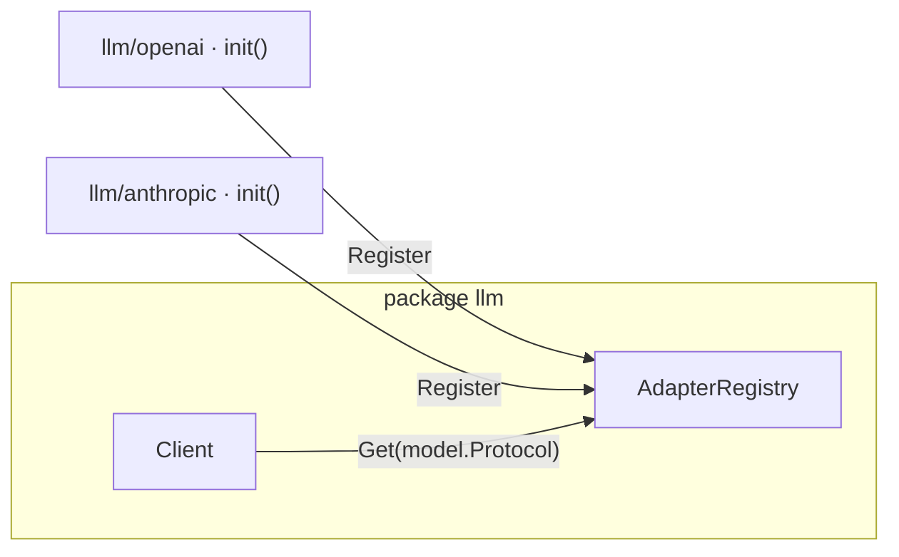
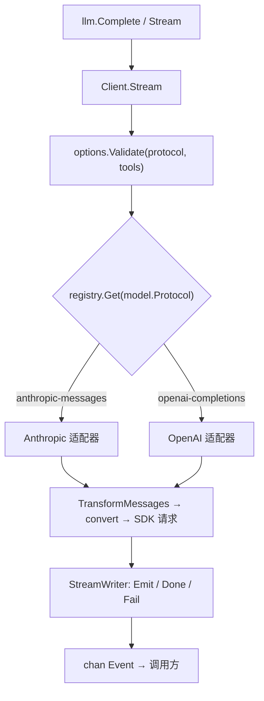

# 架构总览

!!! note "关于本节"
    「源码解析」一节面向贡献者和好奇的读者，讲解 `llm` 包内部如何工作。公开 API 的用法见 [LLM](../llm/README.md) 一节；本节关注的是实现。

`or/llm` 是一个无状态的翻译层。它只决定一次请求该发送什么、以及如何解读流式响应，而把历史存储、上下文压缩和工具循环编排留给调用方。同一段对话可以发往任意一种协议下的任意模型，目标模型还能在轮次之间切换；本库会按请求重新适配历史。

## 包结构

这里没有分开的「门面」与「核心」：公开类型和实现都在同一个包 `llm` 里。协议适配器各自独立成子包，import 时自行注册，因此应用只会链接它真正用到的厂商 SDK。

| 路径 | 职责 |
|---|---|
| [`llm/`](https://github.com/ktsoator/or/tree/main/llm) | 整个中立核心与公开 API：模型、消息、选项、流式、迁移、注册表和默认 client |
| [`llm/openai/`](https://github.com/ktsoator/or/tree/main/llm/openai) | `openai-completions` 适配器；在 `init` 中自行注册 |
| [`llm/anthropic/`](https://github.com/ktsoator/or/tree/main/llm/anthropic) | `anthropic-messages` 适配器；在 `init` 中自行注册 |
| [`llm/all/`](https://github.com/ktsoator/or/tree/main/llm/all) | 空导入两个适配器，供想要全部内置协议的调用方使用 |
| [`llm/internal/`](https://github.com/ktsoator/or/tree/main/llm/internal) | `jsonx`（宽容的 JSON 辅助）与 `genmodels`（模型目录生成器） |

适配器通过副作用被引入：

```go
import (
	"github.com/ktsoator/or/llm"
	_ "github.com/ktsoator/or/llm/anthropic" // 注册 anthropic-messages
)
```

## 注册表、适配器、client 三元组

调度由三个小部件组成，全部在核心包内：

- **`ProtocolAdapter`** —— 一个接口，含 `Protocol()`（它在注册表中的键）和 `Stream()`（单个协议的请求生命周期）。见[协议适配器](adapters.md)。
- **`AdapterRegistry`** —— 一个并发安全的 `map[Protocol]ProtocolAdapter`。厂商的 `init` 函数调用 `llm.Register` 把自己加入包默认注册表；偏好显式接线的调用方用 `NewAdapterRegistry` 和 `AdapterRegistry.Register` 自建。
- **`Client`** —— 持有一个注册表，把每次请求路由到模型协议对应的适配器。`llm.Stream` 和 `llm.Complete` 只是绑定到默认注册表的默认 client 的薄封装。



## 请求的数据流



模型上的 `Protocol` 字段是判别器：`Client.Stream` 用它从注册表中选出适配器。适配器左侧的一切都与厂商无关；适配器内部则可以讲一种具体的线路协议。

## 逐步解读一次请求

```go linenums="1" hl_lines="9"
func (c *Client) Stream(ctx context.Context, model Model, input Context, options StreamOptions) (<-chan Event, error) {
	if c.registry == nil {
		return nil, errors.New("adapter registry is nil")
	}
	if err := options.Validate(model.Protocol, input.Tools); err != nil { // (1)!
		return nil, err
	}

	adapter, ok := c.registry.Get(model.Protocol) // (2)!
	if !ok {
		return nil, fmt.Errorf(
			"no adapter registered for protocol %q",
			model.Protocol,
		)
	}
	if strings.TrimSpace(options.APIKey) == "" {
		options.APIKey = GetEnvAPIKeyWithEnv(model.Provider, options.Env) // (3)!
	}

	return adapter.Stream(ctx, model, input, options)
}
```

1.  协议专属选项会在构建任何 HTTP 请求之前先对目标协议做校验，因此不匹配会尽早失败。
2.  `Protocol` 选定适配器。同一段对话可以发往任意一种协议；本库会按请求重新适配历史。
3.  仅当调用方没有提供 API key 时，才从厂商的环境变量中解析。

源码：[`llm/client.go`](https://github.com/ktsoator/or/blob/main/llm/client.go)、[`llm/adapters.go`](https://github.com/ktsoator/or/blob/main/llm/adapters.go)、[`llm/default.go`](https://github.com/ktsoator/or/blob/main/llm/default.go)。

## 延伸阅读

- [模型与协议](models.md) —— `Model`、它的能力和目录。
- [消息类型系统](messages.md) —— 与厂商无关的对话模型。
- [协议适配器](adapters.md) —— 一种协议如何被翻译和注册。
- [流式机制](streaming.md) —— 事件与 `StreamWriter` 机制。
- [模型切换](transform.md) —— 用 `TransformMessages` 适配历史。
