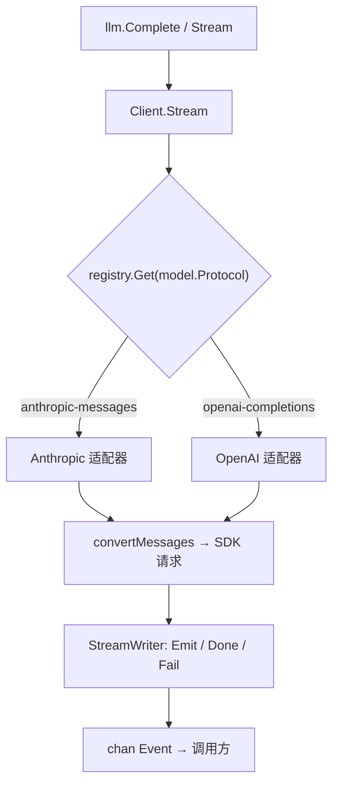

# 架构总览

!!! note "关于本节"
    「源码解析」一节面向贡献者和好奇的读者，讲解 `llm` 包内部如何工作。公开 API 的用法
    见 [LLM](../llm/README.md) 一节；本节关注的是实现。

`or/llm` 是一个无状态的翻译层。它只决定一次请求该发送什么、以及如何解读流式响应，而把
历史存储、上下文压缩和工具循环编排留给调用方。

## 两层结构

| 层 | 位置 | 职责 |
|---|---|---|
| 公开门面 | [`llm/`](https://github.com/ktsoator/or/tree/main/llm) | 类型别名与薄转发，让调用方只需 import 一个包 |
| 内部核心 | [`llm/`](https://github.com/ktsoator/or/tree/main/llm) | 真正的实现，以及 `providers/` 下的各协议适配器 |

## 请求的数据流



模型上的 `Protocol` 字段是判别器：`Client.Stream` 用它从注册表中选出适配器。

## 逐步解读一次请求

```go linenums="1" hl_lines="3"
func (c *Client) Stream(ctx context.Context, model Model, input Context, options StreamOptions) (<-chan Event, error) {
    // …… 校验 ……
    adapter, ok := c.registry.Get(model.Protocol) // (1)!
    // …… 注入 API key ……
    return adapter.Stream(ctx, model, input, options)
}
```

1.  `Protocol` 选定适配器。同一段对话可以发往任意一种协议；本库会按请求重新适配历史。

源码：[`llm/client.go`](https://github.com/ktsoator/or/blob/main/llm/client.go)。

## 延伸阅读

- [消息类型系统](messages.md) —— 与厂商无关的对话模型。
- [协议适配器](adapters.md) —— 一种协议如何被翻译和注册。
- [流式机制](streaming.md) —— 事件与 `StreamWriter` 机制。
- [模型切换](transform.md) —— 用 `TransformMessages` 适配历史。
