# LLM 包

`github.com/ktsoator/or/llm` 提供统一的 Go API，用于在 OpenAI 兼容与 Anthropic 兼容的模型之间进行流式响应、结构化工具、推理内容、多模态消息和对话历史的处理。

## 它是什么

本包是一个**无状态的翻译层**。对每个请求，它只决定在网络上发送什么、以及如何解释流式返回的响应——仅此而已。同一段协议无关的对话可以发给任一协议下的任一模型，且目标模型可以在轮次之间切换；库会每次重新适配历史。

单个请求之上的一切（历史存储、上下文压缩、工具调用循环）都交给调用方。请求本身由两个入口覆盖：

- `Complete` 发送一段对话并返回最终的 `AssistantMessage`。
- `Stream` 返回一个类型化 `Event` 的通道，用于增量渲染。

```mermaid
flowchart LR
    subgraph caller["你的代码"]
        direction TB
        ctx["Context<br/><small>系统提示 · 消息 · 工具</small>"]
        opts["StreamOptions<br/><small>key · temperature · 推理</small>"]
        model["Model<br/><small>协议 · 端点</small>"]
    end

    subgraph lib["llm · 无状态翻译层"]
        direction TB
        entry(["Stream / Complete"])
        adapt["按 Model.Protocol 选适配器<br/><small>重新适配历史 → 线格式</small>"]
        entry --> adapt
    end

    provider["Provider<br/><small>OpenAI 或 Anthropic 兼容</small>"]

    subgraph back["返回给你"]
        direction TB
        events["类型化 Events<br/><small>文本 · 推理 · 工具调用增量</small>"]
        final(["AssistantMessage<br/><small>内容 · 停止原因 · 用量+成本</small>"])
        events --> final
    end

    caller --> entry
    adapt -->|请求| provider
    provider -->|流式响应| events

    classDef accent stroke:#6366f1,stroke-width:2px;
    class entry,final accent;
```



## 第一个请求

解析一个模型、发送提示、读取回复。空导入完成协议注册；当 `StreamOptions` 未填 key 时，它从该 provider 的环境变量读取。

```go
import (
	"github.com/ktsoator/or/llm"
	_ "github.com/ktsoator/or/llm/openai" // 注册 OpenAI 兼容协议
)

model := llm.GetModel("deepseek", "deepseek-v4-flash")

msg, err := llm.Complete(ctx, model,
	llm.Prompt("Explain Go channels briefly."),
	llm.StreamOptions{})
if err != nil {
	log.Fatal(err)
}

fmt.Println(msg.Text())                 // 答案
fmt.Println(msg.Usage.Cost.Total)       // 花了多少
fmt.Println(msg.StopReason)             // 为何停止
```

若要边生成边渲染，改用 `Stream` 并消费增量：

```go
events, err := llm.Stream(ctx, model, llm.Prompt("Write a haiku about Go."), llm.StreamOptions{})
if err != nil {
	log.Fatal(err)
}
for event := range events {
	if event.Type == llm.EventTextDelta {
		fmt.Print(event.Delta)
	}
}
```

## 能力速览

- **两种协议，一套 API**：OpenAI 兼容的 Chat Completions 与 Anthropic 兼容的 Messages，共用同一套类型。
- **流式事件**：文本、推理与工具调用增量以类型化事件呈现，每个都带有到目前为止的消息部分快照。
- **类型化工具**：从 Go 结构体派生 JSON Schema，并把模型的调用解码回该结构体，对畸形参数尽力恢复。
- **协议无关的推理**：单一强度等级映射到各 provider 的原生思考，并钳制到模型支持的范围。
- **多模态输入**：图像可与文本并存，对纯文本模型自动降级。
- **用量与成本**：每个响应按目录计价的 token 计数，含缓存 token。
- **切换模型**：把一段历史发给任意模型或协议，无需重建；库会每次请求重新适配。
- **持久化**：消息序列化为自描述 JSON，之后可对任意模型重放。
- **可扩展**：实现一个适配器即可加入新的线协议，无需改动共享的请求 API。

## 核心对象

五个类型几乎涵盖日常会用到的一切：

| 类型 | 作用 |
|---|---|
| `Model` | 调用哪个模型——用 `GetModel` 从目录解析，或手动构造以指向任意兼容端点 |
| `Context` | 单次请求的输入：系统提示、消息历史、可用工具 |
| `Message` | 历史中的一轮——`UserMessage`、`AssistantMessage` 或 `ToolResultMessage`，各自持有类型化内容块 |
| `StreamOptions` | 按请求的设置：凭证、temperature、max tokens、推理强度、超时与钩子 |
| `AssistantMessage` | 结果：内容、停止原因、带成本的 token 用量，以及诊断 |

## 常见路径

按手头的任务挑选指南：

- **一次请求**：用 `Prompt` 构造 `Context`，调用 `Complete`。见[快速开始](getting-started.md)。
- **多轮**：维护一个不断增长的 `[]Message`，每轮重新发送。见[对话](conversations.md)。
- **流式**：调用 `Stream`，边到达边消费 `Event` 增量。见[流式](streaming.md)。
- **工具**：定义类型化工具并运行工具循环。见[工具](tools.md)。
- **推理**：设置推理强度并读回思考。见[推理](reasoning.md)。
- **切换模型**：把同一段历史发给不同模型或协议。见[对话 § 在不同轮次间切换模型](conversations.md#在不同轮次间切换模型)。

## 选 `llm` 还是 `agent`?

在自行掌控控制流时直接用 `llm`：单次请求、自定义的多轮循环，或需要完全掌控的工具循环。当希望工具调用循环、运行状态、引导与中止由框架代劳时，选[`or/agent`](../agent/README.md)；当还需要转录持久化、上下文压缩、按轮系统提示与 skills 时，选 agent harness。两者都构建在上述类型之上，所以先用 `llm`、之后再采用 agent，不会有任何浪费。

## 安装

```sh
go get github.com/ktsoator/or/llm@latest
```

## 文档

- [快速开始](getting-started.md) — 凭证与第一个请求
- [提供方与模型](providers.md) — 目录发现与自定义端点
- [流式](streaming.md) — 事件、部分响应、诊断与取消
- [工具](tools.md) — 类型化工具、工具循环与协议特定的工具选择
- [推理](reasoning.md) — 推理强度与思考显示
- [读取响应](results.md) — 停止原因、用量与成本、诊断
- [错误处理](errors.md) — 错误出口、缺失密钥与校验
- [对话](conversations.md) — 图像、模型切换与持久化
- [配置](configuration.md) — 重试、超时、请求头与 HTTP 钩子
- [自定义协议](extending.md) — 适配器、注册表与 `StreamWriter`

每个主题的可运行程序列在[示例](examples.md)页。

完整的导出类型和函数，参见[pkg.go.dev](https://pkg.go.dev/github.com/ktsoator/or/llm) 上的包文档。

若想了解本包的内部工作原理，[源码解析](../internals/overview.md)一节是一份包的源码导览：

- [架构总览](../internals/overview.md) —— 包结构、注册表/适配器/client 三元组与请求分派
- [模型与协议](../internals/models.md) —— `Model`、它的能力、按协议解码与目录
- [消息类型系统](../internals/messages.md) —— 与厂商无关的对话模型及其标记接口
- [协议适配器](../internals/adapters.md) —— 适配器契约、注册与构建 SDK client
- [流式机制](../internals/streaming.md) —— `Event` 联合体与 `StreamWriter` 的保证
- [模型切换](../internals/transform.md) —— `TransformMessages` 与溢出检测
