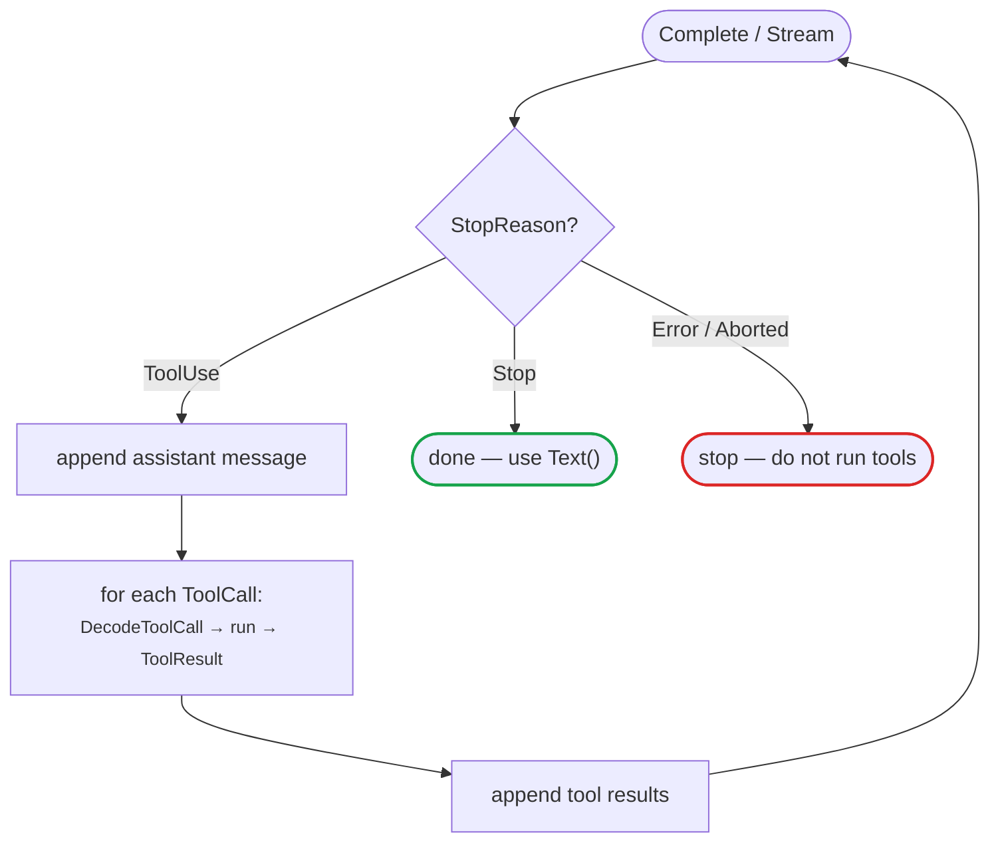

# Tools

A tool is a function you declare and let the model *ask you to call* — to fetch
data, run a calculation, or take an action the model cannot perform itself. The
library never executes anything: it turns your Go type into a schema the model
sees, hands back any calls the model makes, and lets you feed the results in. One
round-trip looks like this: **the model emits a tool call → you decode and run it
→ you send the result back → the model continues with that result in context.**
For example, to answer a weather question the model does not look it up itself —
it emits a `get_weather(city=…)` call, the caller runs it and sends the result
back, and the model answers from that.

This page covers the two halves of that flow: defining typed tools from Go
structs, then running the request → execute → reply cycle as a loop.
`DecodeToolCall` and `ToolResult` are the pieces that connect them.

## At a glance

| Task | API |
|---|---|
| Define a tool from a struct | `NewTool[T]` / `MustTool[T]` → `ToolDefinition` |
| Attach tools to a request | `Context.Tools` |
| Read the model's calls back | `AssistantMessage.ToolCalls()` → `[]ToolCall` |
| Decode a call's arguments | `DecodeToolCall[T]` |
| Return a result | `ToolResult(id, name, text)` → `ToolResultMessage` |
| Validate without a Go type | `ValidateToolCall` / `ValidateToolArguments` / `ParseToolArguments` |
| Force or restrict the choice | `StreamOptions.ProtocolOptions` |

A `ToolDefinition` is just `Name`, `Description`, and a `Parameters` JSON Schema.
A `ToolCall` the model returns carries an `ID`, a `Name`, and decoded
`Arguments`; the `ID` and `Name` are what you echo back in the `ToolResult`.

## Typed tools

Generate a provider-compatible JSON Schema from a Go struct instead of writing
tool parameters by hand. The same type validates, coerces, and decodes the tool
call returned by the model.

**1. Describe the arguments as a struct.** The `jsonschema` tags become schema
constraints. Fields without `omitempty` are required. The generated schema is
fully inline and omits document metadata such as `$schema`, `$id`, `$ref`, and
`$defs`.

```go
type WeatherArgs struct {
	City  string `json:"city" jsonschema:"description=City name,minLength=1"`
	Units string `json:"units,omitempty" jsonschema:"enum=celsius,enum=fahrenheit"`
	Days  int    `json:"days" jsonschema:"minimum=1,maximum=10"`
}
```

The `jsonschema` tag understands the constraints the library validates against
the model's returned arguments:

| Constraint | Tag | Applies to |
|---|---|---|
| Required | omit `omitempty` (add it to make the field optional) | any |
| Description | `description=...` | any |
| Enum | `enum=celsius,enum=fahrenheit` | string, number |
| Numeric range | `minimum=` · `maximum=` · `exclusiveMinimum=` · `exclusiveMaximum=` | number, integer |
| String length | `minLength=` · `maxLength=` | string |
| Pattern | `pattern=^[A-Z]` | string |
| Array length | `minItems=` · `maxItems=` | array |

**2. Build the tool from the type** and attach it to the request context.

```go
weatherTool := llm.MustTool[WeatherArgs]("get_weather", "Get a weather forecast")

input := llm.Context{
	Messages: []llm.Message{
		llm.UserText("What's the weather in Shanghai for the next 3 days?"),
	},
	Tools: []llm.ToolDefinition{weatherTool},
}
```

**3. Send the request and read the calls back.** `response.ToolCalls()` returns
every call the model made; append the assistant message to the history first so
its tool results can follow.

```go
response, err := llm.Complete(ctx, model, input, llm.StreamOptions{})
if err != nil {
	log.Fatal(err)
}
messages = append(messages, &response)
```

**4. Decode each call, return a result, and ask again.** `DecodeToolCall`
validates the arguments against the schema and decodes them into `WeatherArgs`,
so the values are ready to use.

```go
for _, toolCall := range response.ToolCalls() {
	arguments, err := llm.DecodeToolCall[WeatherArgs](weatherTool, toolCall)
	if err != nil {
		log.Fatal(err)
	}
	result := fmt.Sprintf("%s will be sunny for %d days.", arguments.City, arguments.Days)
	messages = append(messages, llm.ToolResult(toolCall.ID, toolCall.Name, result))
}
```

Sending the tool results back in a second `Complete` lets the model turn them
into a final answer.

<details>
<summary>Full program</summary>

```go
package main

import (
	"context"
	"fmt"
	"log"

	"github.com/ktsoator/or/llm"
	_ "github.com/ktsoator/or/llm/openai" // registers the OpenAI-compatible protocol
)

type WeatherArgs struct {
	City  string `json:"city" jsonschema:"description=City name,minLength=1"`
	Units string `json:"units,omitempty" jsonschema:"enum=celsius,enum=fahrenheit"`
	Days  int    `json:"days" jsonschema:"minimum=1,maximum=10"`
}

func main() {
	ctx := context.Background()
	model := llm.GetModel("deepseek", "deepseek-v4-flash")
	weatherTool := llm.MustTool[WeatherArgs](
		"get_weather",
		"Get a weather forecast",
	)

	messages := []llm.Message{
		llm.UserText("What's the weather in Shanghai for the next 3 days?"),
	}
	input := llm.Context{
		Messages: messages,
		Tools:    []llm.ToolDefinition{weatherTool},
	}

	response, err := llm.Complete(ctx, model, input, llm.StreamOptions{})
	if err != nil {
		log.Fatal(err)
	}
	messages = append(messages, &response)

	toolUsed := false
	for _, toolCall := range response.ToolCalls() {
		if toolCall.Name != weatherTool.Name {
			continue
		}

		arguments, err := llm.DecodeToolCall[WeatherArgs](weatherTool, toolCall)
		if err != nil {
			log.Fatal(err)
		}
		result := fmt.Sprintf(
			"%s will be sunny for the next %d days (%s).",
			arguments.City,
			arguments.Days,
			arguments.Units,
		)
		messages = append(messages, llm.ToolResult(toolCall.ID, toolCall.Name, result))
		toolUsed = true
	}
	if !toolUsed {
		log.Fatal("model returned no weather tool call")
	}

	response, err = llm.Complete(ctx, model, llm.Context{
		Messages: messages,
		Tools:    []llm.ToolDefinition{weatherTool},
	}, llm.StreamOptions{})
	if err != nil {
		log.Fatal(err)
	}
	fmt.Println(response.Text())
}
```

</details>

`MustTool` panics when the type cannot produce a valid schema, which suits
tools declared at startup. Use `NewTool`, which returns an error instead, when a
tool is built dynamically and a failure must be handled rather than crash.

## Run the tool loop

The example above handles a single round for clarity. A real application loops:
the model may call tools, read the results, then call more tools before it
answers. `StopReason` tells you which case you are in, so gate the loop on it
rather than on the presence of tool calls alone.



- `StopReasonToolUse` — the model wants tool results. Execute the calls, append
  each result, and call the model again.
- `StopReasonStop` — the model answered. Return `response.Text()`.
- `StopReasonLength` — output hit the token cap; the turn is truncated.
- `StopReasonError` / `StopReasonAborted` — the request failed or was
  cancelled. Never execute tool calls from such a response.

A request may declare several tools in `Context.Tools`, and one turn may contain
more than one `ToolCall`. Iterate over `ToolCalls()` and route by `call.Name`;
the inner loop below appends one `ToolResult` per call, in order.

```go
for {
	response, err := llm.Complete(ctx, model, llm.Context{
		Messages: messages,
		Tools:    []llm.ToolDefinition{weatherTool},
	}, llm.StreamOptions{})
	if err != nil {
		log.Fatal(err) // a failed response may still carry partial content
	}

	if response.StopReason != llm.StopReasonToolUse {
		fmt.Println(response.Text())
		break
	}

	// The assistant message must precede its tool results in the history.
	messages = append(messages, &response)
	for _, toolCall := range response.ToolCalls() {
		arguments, err := llm.DecodeToolCall[WeatherArgs](weatherTool, toolCall)
		if err != nil {
			// Return the error to the model so it can correct the call.
			result := llm.ToolResult(toolCall.ID, toolCall.Name, err.Error())
			result.IsError = true
			messages = append(messages, result)
			continue
		}
		// runWeather is your own code that does the work and returns result text.
		messages = append(messages, llm.ToolResult(
			toolCall.ID, toolCall.Name, runWeather(arguments)))
	}
}
```

Running the tool itself — `runWeather` in the example — is your application code;
`llm` does not execute it. The library only hands back the model's calls and
folds each `ToolResult` into the history, so there is no separate execution step
to document.

!!! check "Production tool-loop checklist"
    - **Gate on `StopReason`, not on the presence of tool calls.** Loop while it
      is `StopReasonToolUse`; stop on `StopReasonStop`.
    - **Append the assistant message before its tool results.** The order in the
      history must be assistant turn, then each `ToolResult`.
    - **Match every tool call with a result.** Send one `ToolResult` per call, so
      no call is left unanswered in the next request.
    - **On decode failure, return a tool error, don't crash.** Set
      `result.IsError = true` and feed the message back so the model can correct
      its arguments.
    - **Bound the loop.** Cap the number of rounds so a misbehaving model cannot
      spin forever.
    - **Inspect diagnostics before side effects.** Decline `partial` or
      `invalid` arguments before executing a tool that writes or spends. See
      [stream diagnostics](streaming.md#tool-call-deltas-and-diagnostics).

## Validate before executing

`DecodeToolCall` validates arguments against the tool schema and decodes them
into your struct in one step; it is the path most applications use. When you do
not have a Go type for the arguments, validate into a generic map instead:

- `ValidateToolCall(tools, call)` — find the matching tool by name, then
  validate and coerce; returns the arguments as `map[string]any`.
- `ValidateToolArguments(tool, call)` — validate against one known tool.
- `ParseToolArguments(raw)` — best-effort parse of raw argument JSON with no
  schema check; pair with `ParseToolArgumentsMode` to learn whether the JSON was
  strict, repaired, partial, or invalid.

Tool arguments streamed by a provider may be recovered from incomplete JSON.
A safe application declines `partial` and `invalid` arguments and returns a tool
error so the model can retry. See
[stream diagnostics](streaming.md#tool-call-deltas-and-diagnostics) before
executing tools with side effects.

## Protocol-specific tool choice

Tool choice retains each protocol's native vocabulary. Supply it through
`ProtocolOptions`; the client validates that its type matches the selected
model protocol and that a named tool exists in the request context.

OpenAI-compatible Chat Completions uses `required` and function choices:

```go
options := llm.StreamOptions{
	ProtocolOptions: &llm.OpenAICompletionsStreamOptions{
		ToolChoice: llm.OpenAIToolChoiceRequired,
		// To force one function instead:
		// ToolChoice: llm.OpenAIToolChoiceFunction{Name: "get_weather"},
	},
}
```

Anthropic Messages uses `any` and tool choices:

```go
options := llm.StreamOptions{
	ProtocolOptions: &llm.AnthropicStreamOptions{
		ToolChoice: llm.AnthropicToolChoiceAny,
		// To force one tool instead:
		// ToolChoice: llm.AnthropicToolChoiceTool{Name: "get_weather"},
	},
}
```

Both protocols expose `Auto` and `None` constants. Any explicit tool choice
requires at least one tool in `Context.Tools`.

## Automating the loop

The request → execute → reply loop above is what [`or/agent`](../agent/README.md)
runs for you. Instead of hand-writing the `StopReason` gating, message
bookkeeping, and dispatch, you give each tool an `Execute` function and call
`Prompt` once — the tool's `llm.MustTool[T]` definition carries over verbatim:

```go
weather := agent.AgentTool{
	Definition: llm.MustTool[WeatherArgs]("get_weather", "Get a weather forecast"),
	Execute: func(ctx context.Context, callID string, args json.RawMessage,
		onUpdate func(agent.ToolResult)) (agent.ToolResult, error) {
		// decode args, do the work, return the result
	},
}

assistant := agent.New(agent.Options{Model: model, Tools: []agent.AgentTool{weather}})
err := assistant.Prompt(ctx, "What should I pack for Beijing?")
```

On top of the loop, the agent adds what an application needs around it:

- **Streaming events** — `Subscribe` to text, reasoning, tool, and lifecycle events.
- **Steering and follow-ups** — inject messages mid-run with `Steer` / `FollowUp`.
- **Cancellation and state** — `Abort` a run; read a `Snapshot` of its state.
- **Per-turn control** — swap the model, system prompt, or tools between turns.

Reach for `agent` when you want these handled; stay with `llm` when you want full
control of the loop itself. See the [agent guide](../agent/README.md) to start.
