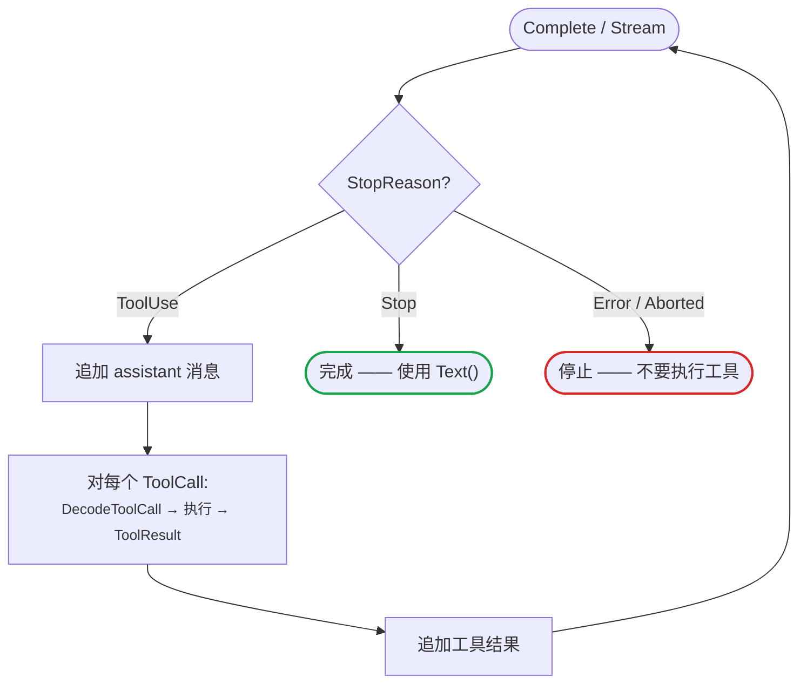

# 工具

工具是一类经声明后可供模型请求调用的函数——用于获取数据、执行计算,或完成模型自身无法完成的操作。本库本身不执行任何操作:它将 Go 类型转换为模型可见的 schema,把模型发起的调用交回调用方,再由调用方将结果回传。

一次完整的往返如下:**模型发起工具调用 → 解码并执行 → 将结果回传 → 模型在上下文中带着该结果继续。** 

举例来说,模型要查天气时不会自己去查,而是发出一个 `get_weather(city=…)` 调用;调用方查到结果后回传,模型再据此作答。

本页覆盖该流程的两个部分:先从 Go 结构体定义类型化工具,再将"请求 → 执行 → 回传"这一往返组织成循环。`DecodeToolCall` 与 `ToolResult` 即是衔接两者的部件。

## 速览

| 任务 | API |
|---|---|
| 从结构体定义工具 | `NewTool[T]` / `MustTool[T]` → `ToolDefinition` |
| 把工具挂到请求 | `Context.Tools` |
| 读回模型的调用 | `AssistantMessage.ToolCalls()` → `[]ToolCall` |
| 解码调用的参数 | `DecodeToolCall[T]` |
| 回传结果 | `ToolResult(id, name, text)` → `ToolResultMessage` |
| 无 Go 类型时校验 | `ValidateToolCall` / `ValidateToolArguments` / `ParseToolArguments` |
| 强制或限制选择 | `StreamOptions.ProtocolOptions` |

`ToolDefinition` 只包含 `Name`、`Description` 与一段 `Parameters` JSON Schema。模型返回的 `ToolCall` 携带 `ID`、`Name` 与解码后的 `Arguments`;回传 `ToolResult` 时需回填其 `ID` 与 `Name`。

## 类型化工具

从 Go 结构体生成与提供方兼容的 JSON Schema，而无需手写工具参数。同一个类型既用于校验、强制转换，也用于解码模型返回的工具调用。

**1. 用结构体描述参数。** `jsonschema` 标签会转化为 schema 约束。没有 `omitempty` 的字段为必填。生成的 schema 完全内联，并省略了 `$schema`、`$id`、`$ref`、`$defs` 等文档元数据。

```go
type WeatherArgs struct {
	City  string `json:"city" jsonschema:"description=City name,minLength=1"`
	Units string `json:"units,omitempty" jsonschema:"enum=celsius,enum=fahrenheit"`
	Days  int    `json:"days" jsonschema:"minimum=1,maximum=10"`
}
```

`jsonschema` 标签支持以下约束,库会据此校验模型返回的参数:

| 约束 | 标签 | 适用类型 |
|---|---|---|
| 必填 | 省略 `omitempty`(加上即为可选) | 全部 |
| 描述 | `description=...` | 全部 |
| 枚举 | `enum=celsius,enum=fahrenheit` | string、number |
| 数值范围 | `minimum=` · `maximum=` · `exclusiveMinimum=` · `exclusiveMaximum=` | number、integer |
| 字符串长度 | `minLength=` · `maxLength=` | string |
| 正则 | `pattern=^[A-Z]` | string |
| 数组长度 | `minItems=` · `maxItems=` | array |

**2. 从类型构建工具**,并挂到请求 context 上。

```go
weatherTool := llm.MustTool[WeatherArgs]("get_weather", "Get a weather forecast")

input := llm.Context{
	Messages: []llm.Message{
		llm.UserText("What's the weather in Shanghai for the next 3 days?"),
	},
	Tools: []llm.ToolDefinition{weatherTool},
}
```

**3. 发送请求并读回工具调用。** `response.ToolCalls()` 返回模型发起的每个调用;先把助手消息追加进历史,后续的工具结果才能跟在它后面。

```go
response, err := llm.Complete(ctx, model, input, llm.StreamOptions{})
if err != nil {
	log.Fatal(err)
}
messages = append(messages, &response)
```

**4. 解码每个调用、返回结果,再次询问。** `DecodeToolCall` 会按 schema 校验参数并解码进 `WeatherArgs`,得到可直接使用的值。

```go
for _, toolCall := range response.ToolCalls() {
	arguments, err := llm.DecodeToolCall[WeatherArgs](weatherTool, toolCall)
	if err != nil {
		log.Fatal(err)
	}
	result := fmt.Sprintf("%s will be sunny for %d days.", arguments.City, arguments.Days)
	messages = append(messages, llm.ToolResult(toolCall.ID, toolCall.Name, result))
}
```

把工具结果放进第二次 `Complete` 发回去,模型就能据此给出最终答案。

<details>
<summary>完整程序</summary>

```go
package main

import (
	"context"
	"fmt"
	"log"

	"github.com/ktsoator/or/llm"
	_ "github.com/ktsoator/or/llm/openai" // 注册 OpenAI 兼容协议
)

type WeatherArgs struct {
	City  string `json:"city" jsonschema:"description=City name,minLength=1"`
	Units string `json:"units,omitempty" jsonschema:"enum=celsius,enum=fahrenheit"`
	Days  int    `json:"days" jsonschema:"minimum=1,maximum=10"`
}

func main() {
	ctx := context.Background()
	model := llm.GetModel("deepseek", "deepseek-v4-flash")
	weatherTool := llm.MustTool[WeatherArgs](
		"get_weather",
		"Get a weather forecast",
	)

	messages := []llm.Message{
		llm.UserText("What's the weather in Shanghai for the next 3 days?"),
	}
	input := llm.Context{
		Messages: messages,
		Tools:    []llm.ToolDefinition{weatherTool},
	}

	response, err := llm.Complete(ctx, model, input, llm.StreamOptions{})
	if err != nil {
		log.Fatal(err)
	}
	messages = append(messages, &response)

	toolUsed := false
	for _, toolCall := range response.ToolCalls() {
		if toolCall.Name != weatherTool.Name {
			continue
		}

		arguments, err := llm.DecodeToolCall[WeatherArgs](weatherTool, toolCall)
		if err != nil {
			log.Fatal(err)
		}
		result := fmt.Sprintf(
			"%s will be sunny for the next %d days (%s).",
			arguments.City,
			arguments.Days,
			arguments.Units,
		)
		messages = append(messages, llm.ToolResult(toolCall.ID, toolCall.Name, result))
		toolUsed = true
	}
	if !toolUsed {
		log.Fatal("model returned no weather tool call")
	}

	response, err = llm.Complete(ctx, model, llm.Context{
		Messages: messages,
		Tools:    []llm.ToolDefinition{weatherTool},
	}, llm.StreamOptions{})
	if err != nil {
		log.Fatal(err)
	}
	fmt.Println(response.Text())
}
```

</details>

当类型无法生成有效 schema 时，`MustTool` 会 panic，适合在启动阶段声明的工具。若工具是动态构建的、需要处理失败而非崩溃，请改用返回 error 的 `NewTool`。

## 运行工具循环

上面的示例为清晰起见只处理了一轮。真实应用需要循环:模型可能调用工具、读取结果，再调用更多工具，最后才作答。`StopReason` 会指明当前处于哪种情况，因此应据其控制循环，而不是仅凭是否存在工具调用。



- `StopReasonToolUse` — 模型需要工具结果。执行这些调用，逐个追加结果，再次调用模型。
- `StopReasonStop` — 模型已作答。返回 `response.Text()`。
- `StopReasonLength` — 输出触达 token 上限，本轮被截断。
- `StopReasonError` / `StopReasonAborted` — 请求失败或被取消。绝不要执行这类响应中的工具调用。

一次请求可在 `Context.Tools` 中声明多个工具,单轮也可能包含不止一个 `ToolCall`。遍历 `ToolCalls()` 并按 `call.Name` 分派;下面的内层循环会按顺序为每个调用追加一个 `ToolResult`。

```go
for {
	response, err := llm.Complete(ctx, model, llm.Context{
		Messages: messages,
		Tools:    []llm.ToolDefinition{weatherTool},
	}, llm.StreamOptions{})
	if err != nil {
		log.Fatal(err) // 失败的响应仍可能携带部分内容
	}

	if response.StopReason != llm.StopReasonToolUse {
		fmt.Println(response.Text())
		break
	}

	// 在历史中，助手消息必须排在它的工具结果之前。
	messages = append(messages, &response)
	for _, toolCall := range response.ToolCalls() {
		arguments, err := llm.DecodeToolCall[WeatherArgs](weatherTool, toolCall)
		if err != nil {
			// 将错误返回给模型，让它纠正这次调用。
			result := llm.ToolResult(toolCall.ID, toolCall.Name, err.Error())
			result.IsError = true
			messages = append(messages, result)
			continue
		}
		// runWeather 为调用方的工具实现:执行并返回结果文本。
		messages = append(messages, llm.ToolResult(
			toolCall.ID, toolCall.Name, runWeather(arguments)))
	}
}
```

工具的实际执行——示例中的 `runWeather`——是调用方的应用代码,`llm` 并不介入;它只负责把模型发起的调用交回,并把返回的 `ToolResult` 编回历史。中间"真正运行工具"这一步不含任何库特定内容,因此本页没有单独的执行章节。

!!! check "生产环境工具循环清单"
    - **以 `StopReason` 为准,而非是否存在工具调用。** 当它为 `StopReasonToolUse` 时继续循环;为 `StopReasonStop` 时停止。
    - **先追加 assistant 消息,再追加其工具结果。** 历史中的顺序必须是先 assistant 这一轮,然后是各个 `ToolResult`。
    - **每个工具调用都要有对应结果。** 每个调用回传一个 `ToolResult`,不要让任何调用在下次请求中悬空未答。
    - **decode 失败时回传工具错误,不要崩溃。** 设置 `result.IsError = true` 并把该消息回传,让模型纠正参数。
    - **为循环设上界。** 限制轮数,避免行为异常的模型无限循环。
    - **有副作用前先看诊断。** 在执行会写入或消耗资源的工具前,拒绝 `partial` 或 `invalid` 参数。见[流式诊断](streaming.md#工具调用增量与诊断)。

## 执行前校验

`DecodeToolCall` 会按工具 schema 校验参数并一步解码进目标结构体，这是大多数应用采用的路径。当参数没有对应的 Go 类型时，可改为校验成通用 map:

- `ValidateToolCall(tools, call)` — 按名称匹配工具，然后校验并强制转换;以 `map[string]any` 返回参数。
- `ValidateToolArguments(tool, call)` — 针对一个已知工具进行校验。
- `ParseToolArguments(raw)` — 对原始参数 JSON 做尽力解析，不做 schema 校验;搭配 `ParseToolArgumentsMode` 可得知 JSON 是严格、已修复、部分还是无效。

提供方流式传来的工具参数可能从不完整的 JSON 中恢复而来。稳妥的应用会拒绝 `partial` 和 `invalid` 的参数，并返回一个工具错误让模型重试。在执行带副作用的工具前，请先阅读[流式诊断](streaming.md#工具调用增量与诊断)。

## 协议特定的工具选择

工具选择保留各协议自身的原生写法。通过 `ProtocolOptions` 提供；客户端会校验它的类型与所选模型协议是否匹配，以及被命名的工具是否存在于请求 context 中。

OpenAI 兼容的 Chat Completions 使用 `required` 和 function 选择：

```go
options := llm.StreamOptions{
	ProtocolOptions: &llm.OpenAICompletionsStreamOptions{
		ToolChoice: llm.OpenAIToolChoiceRequired,
		// 若要强制调用某一个 function：
		// ToolChoice: llm.OpenAIToolChoiceFunction{Name: "get_weather"},
	},
}
```

Anthropic Messages 使用 `any` 和 tool 选择：

```go
options := llm.StreamOptions{
	ProtocolOptions: &llm.AnthropicStreamOptions{
		ToolChoice: llm.AnthropicToolChoiceAny,
		// 若要强制调用某一个工具：
		// ToolChoice: llm.AnthropicToolChoiceTool{Name: "get_weather"},
	},
}
```

两种协议都提供 `Auto` 和 `None` 常量。任何显式的工具选择都要求 `Context.Tools` 中至少有一个工具。

## 交由 agent 自动化

上面这条"请求 → 执行 → 回传"的循环,正是 [`or/agent`](../agent/README.md) 替你运行的部分。无需手写 `StopReason` 判定、消息记账与分派,只需为每个工具提供一个 `Execute` 函数,再调用一次 `Prompt`——工具的 `llm.MustTool[T]` 定义可原样沿用:

```go
weather := agent.AgentTool{
	Definition: llm.MustTool[WeatherArgs]("get_weather", "Get a weather forecast"),
	Execute: func(ctx context.Context, callID string, args json.RawMessage,
		onUpdate func(agent.ToolResult)) (agent.ToolResult, error) {
		// 解码参数、执行工作、返回结果
	},
}

assistant := agent.New(agent.Options{Model: model, Tools: []agent.AgentTool{weather}})
err := assistant.Prompt(ctx, "去北京该带些什么?")
```

在循环之上,agent 补齐了应用需要的周边能力:

- **流式事件** —— 用 `Subscribe` 订阅文本、推理、工具与生命周期事件。
- **引导与追加** —— 用 `Steer` / `FollowUp` 在运行途中注入消息。
- **取消与状态** —— 用 `Abort` 中止运行;用 `Snapshot` 读取其状态。
- **按轮控制** —— 在轮次之间更换模型、系统提示或工具。

需要这些时就用 `agent`;想完全掌控循环本身时留在 `llm`。上手见 [agent 指南](../agent/README.md)。
