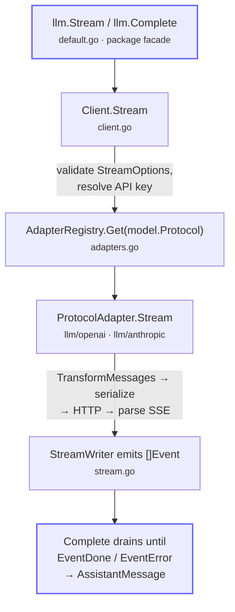

# `llm` — source map

English | [简体中文](README.zh.md)

A provider-neutral API for large language models. One set of types speaks two
wire protocols (OpenAI Chat Completions and Anthropic Messages); the same
conversation can be sent to any model on either protocol, re-adapted per request.
The package is a stateless translation layer — it decides what to send and how to
read the streamed response, and leaves history storage, compaction, and the
tool loop to the caller.

This document maps the source for people reading or extending the package. For
usage see the [package docs on pkg.go.dev](https://pkg.go.dev/github.com/ktsoator/or/llm)
(the godoc in [`doc.go`](doc.go)) and the [guides](../docs/llm/README.md). Each
block below links to the matching [internals guide](../docs/internals/overview.md)
for a deep dive with annotated code.

## The five blocks

The package is roughly five layers, listed here in the order they build on each
other. Reading them top to bottom is also a reasonable path through the source.
Blocks 1–2 are the trunk every request flows through; blocks 3–5 are read on
demand.

### 1. Domain types — the vocabulary

What a conversation, a model, and a streamed event *are*. These provider-neutral
types are the vocabulary every other file speaks; nothing here imports a vendor
SDK. Everything else builds on them, so start here.

| File | Holds |
|---|---|
| [`message.go`](message.go) | `Message`, `UserMessage`/`AssistantMessage`/`ToolResultMessage`, content blocks (`TextContent`, `ThinkingContent`, `ImageContent`, `ToolCall`), `Context`, `ToolDefinition`, `Usage`, `StopReason`. Role marker interfaces make illegal block placement a compile error |
| [`model.go`](model.go) | `Model`, `Protocol`, `ModelThinkingLevel`, `ModelCost`, per-protocol compatibility with discriminated decoding, and single-model operations (`CalculateCost`, `SupportedThinkingLevels`, `ClampThinkingLevel`) |
| [`events.go`](events.go) | `Event` and `EventType` — the unit of a stream, a flat union whose valid fields depend on `Type` |

**Deep dive:** [Message types](../docs/internals/messages.md) · [Models and protocols](../docs/internals/models.md) · [Streaming internals](../docs/internals/streaming.md)

### 2. Entry & dispatch — how a request runs

The path from a call to a provider adapter. **The public entry points live here.**
A request is validated, routed to the adapter registered for its protocol, and
streamed back — the package never talks to a provider directly.

| File | Holds |
|---|---|
| [`default.go`](default.go) | Package-level `Stream`/`Complete`/`Register`/`SupportsProtocol` over a default client; documents the import-for-side-effects registration pattern. **Start reading here.** |
| [`client.go`](client.go) | `Client.Stream`/`Complete`: validate options, pick the adapter, inject the API key, consume the stream |
| [`adapters.go`](adapters.go) | `ProtocolAdapter` (the extension point providers implement) and `AdapterRegistry`, the concurrency-safe protocol→adapter map |
| [`options.go`](options.go) | `StreamOptions`, protocol-specific extensions (`AnthropicStreamOptions`, `OpenAICompletionsStreamOptions`), native tool-choice types, and their validation |

**Deep dive:** [Architecture overview](../docs/internals/overview.md) · [Protocol adapters](../docs/internals/adapters.md)

### 3. Model catalog

Where the built-in models come from, and how they are stored and looked up at
runtime.

| File | Holds |
|---|---|
| [`model_registry.go`](model_registry.go) | `ModelRegistry` (provider → model ID → `Model`, returning deep copies) and the package-level `LookupModel`/`GetModel`/`GetProviders`/`GetModels`/`GetRunnableModels` |
| [`catalog.go`](catalog.go) | `//go:embed` of the generated catalog and the `go:generate` directive (data produced by [`internal/genmodels`](internal/genmodels)), decoded into the registry at startup |

**Deep dive:** [Models and protocols](../docs/internals/models.md)

### 4. Tool calls

The lifecycle of a tool call, from definition to validated arguments. Malformed
argument JSON degrades to a best-effort value rather than failing the response.

| File | Holds |
|---|---|
| [`tools.go`](tools.go) | `NewTool`/`MustTool` (derive a JSON Schema from a Go struct) and `DecodeToolCall` |
| [`jsonparse.go`](jsonparse.go) | Best-effort parsing of the argument JSON a model streams (`ParseToolArguments`, `ArgumentsMode`) |
| [`validation.go`](validation.go) | `ValidateToolCall`/`ValidateToolArguments` — the thin validation entry point |
| [`jsonschema.go`](jsonschema.go) | The generic JSON-Schema coercion + validation engine that does validation's heavy lifting |
| [`diagnostics.go`](diagnostics.go) | `Diagnostic` and `ToolArgumentsDiagnostic` — recorded when arguments are repaired rather than parsed cleanly |

**Deep dive:** [Tools guide](../docs/llm/tools.md)

### 5. Codec & helpers — read on demand

Supporting machinery; none of it is needed to understand the main flow.

| File | Holds |
|---|---|
| [`message_json.go`](message_json.go) | JSON marshal/unmarshal for every message and content type — the self-describing encoding that lets a history be persisted and replayed (large, but single-purpose) |
| [`transform.go`](transform.go) | `TransformMessages`: adapts a stored history for a target model — downgrades unsupported images, reconciles reasoning across models, normalizes tool-call IDs, repairs orphaned tool calls |
| [`stream.go`](stream.go) | `StreamWriter`: the shared machinery an adapter uses to emit events with a single-terminal guarantee and a `Partial` snapshot per event |
| [`prompt.go`](prompt.go) | `Prompt`/`UserText`/`ToolResult` convenience constructors |
| [`keys.go`](keys.go) | API-key lookup from provider environment variables |
| [`overflow.go`](overflow.go) | `IsContextOverflow` context-window detection across provider phrasings |
| [`jsonhelpers.go`](jsonhelpers.go) | JSON deep-copy and `isJSONNull` |

**Deep dive:** [Switching models](../docs/internals/transform.md) · [Streaming internals](../docs/internals/streaming.md)

## Request flow

A request enters through the package facade and is validated, routed, adapted,
and streamed back:

1. **`llm.Stream` / `llm.Complete`** (`default.go`) forward to the default client.
2. **`Client.Stream`** (`client.go`) validates `StreamOptions` and resolves the API key from the provider environment when the caller left it empty.
3. **`AdapterRegistry.Get(model.Protocol)`** (`adapters.go`) selects the adapter registered for the model's protocol.
4. **`ProtocolAdapter.Stream`** (`llm/openai`, `llm/anthropic`) runs `TransformMessages`, serializes the request, calls the provider over HTTP, and parses the streamed response.
5. **`StreamWriter`** (`stream.go`) rebuilds the response as a sequence of `Event`s, guaranteeing exactly one terminal event.
6. **`Complete`** is a thin consumer over `Stream`: it drains events until `EventDone` or `EventError` and returns the final `AssistantMessage`, or the error the terminal event carries.

## Shortest path to understanding

`doc.go` → `message.go` + `model.go` → `default.go` → `client.go` →
`adapters.go`, then read one provider (`openai/`) to see how a protocol is
actually implemented. Blocks 1–2 cover the trunk; 3–5 are read on demand. For a
narrated tour of each layer with annotated source, follow the
[internals guides](../docs/internals/overview.md).

## Subpackages

| Package | Role |
|---|---|
| [`openai/`](openai) | The OpenAI Chat Completions adapter; registers itself on import |
| [`anthropic/`](anthropic) | The Anthropic Messages adapter; registers itself on import |
| [`all/`](all) | Blank-imports both providers to register every built-in protocol at once |
| [`internal/jsonx`](internal/jsonx) | Partial/lenient JSON parsing used by `jsonparse.go` |
| [`internal/genmodels`](internal/genmodels) | Generator for `catalog.generated.json` |

A provider package implements `ProtocolAdapter`, translates the neutral
`Message`/`StreamOptions` into its wire format, and calls `Register` from an
`init` function. Adding a genuinely new wire protocol means implementing that
interface and registering it — see the [extending guide](../docs/llm/extending.md).
