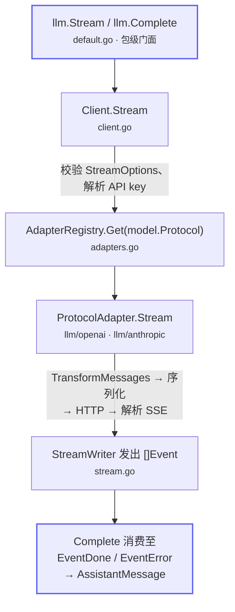

# `llm` — 源码导览

[English](README.md) | 简体中文

面向大语言模型的、与厂商无关的统一 API。一套类型同时支持两种 wire 协议（OpenAI Chat Completions 与 Anthropic Messages）；同一段对话可以发给任一协议下的任意模型，每次请求都会重新适配。本包是一个无状态的翻译层——只负责决定「发什么」以及「如何解读流式响应」，把历史存储、上下文压缩和工具循环交给调用方。

本文为阅读或扩展本包的人梳理源码结构。用法请看 [pkg.go.dev 上的包文档](https://pkg.go.dev/github.com/ktsoator/or/llm)（即 [`doc.go`](doc.go) 中的 godoc）与[使用指南](../docs/llm/README.zh.md)。下面每一块都链接到对应的[内部实现指南](../docs/internals/overview.zh.md)，那里有带注解代码的深入讲解。

## 五大块

本包大致分为五层，下面按彼此依赖的顺序排列。自上而下阅读也是一条合理的源码路径。第 1–2 块是每个请求都要流经的主干；第 3–5 块按需阅读。

### 1. 领域类型 —— 词汇表

先搞清楚「一段对话、一个模型、一个流式事件」到底是什么。这些与厂商无关的类型是其余每个文件共同使用的词汇，这里不导入任何厂商 SDK。其余一切都建立在它们之上，从这里开始。

| 文件 | 内容 |
|---|---|
| [`message.go`](message.go) | `Message`、`UserMessage`/`AssistantMessage`/`ToolResultMessage`、内容块（`TextContent`、`ThinkingContent`、`ImageContent`、`ToolCall`）、`Context`、`ToolDefinition`、`Usage`、`StopReason`。角色标记接口把非法的块放置变成编译错误 |
| [`model.go`](model.go) | `Model`、`Protocol`、`ModelThinkingLevel`、`ModelCost`、含判别式解码的各协议兼容性配置，以及单模型操作（`CalculateCost`、`SupportedThinkingLevels`、`ClampThinkingLevel`） |
| [`events.go`](events.go) | `Event` 与 `EventType`——流的基本单位，一个有效字段取决于 `Type` 的平铺联合体 |

**深入：** [消息类型系统](../docs/internals/messages.zh.md) · [模型与协议](../docs/internals/models.zh.md) · [流式机制](../docs/internals/streaming.zh.md)

### 2. 入口与派发 —— 请求如何跑起来

从一次调用到 provider adapter 的路径。**对外入口在这里。** 请求先经校验，路由到其协议对应的 adapter，再流式返回——本包从不直接与 provider 通信。

| 文件 | 内容 |
|---|---|
| [`default.go`](default.go) | 包级 `Stream`/`Complete`/`Register`，基于默认 client；说明了「import 触发 init 注册」的用法。**建议从这里开始读。** |
| [`client.go`](client.go) | `Client.Stream`/`Complete`：校验选项、选中 adapter、注入 API key、消费流 |
| [`adapters.go`](adapters.go) | `ProtocolAdapter`（provider 实现的扩展点）与 `AdapterRegistry`——并发安全的「协议 → adapter」映射 |
| [`options.go`](options.go) | `StreamOptions`、协议特化扩展（`AnthropicStreamOptions`、`OpenAICompletionsStreamOptions`）、各家原生 tool-choice 类型及其校验 |

**深入：** [架构总览](../docs/internals/overview.zh.md) · [协议适配器](../docs/internals/adapters.zh.md)

### 3. 模型目录

内置模型从哪里来，以及运行期如何存储与查找。

| 文件 | 内容 |
|---|---|
| [`model_registry.go`](model_registry.go) | `ModelRegistry`（厂商 → 模型 ID → `Model`，返回深拷贝）及包级 `LookupModel`/`GetModel`/`GetProviders`/`GetModels` |
| [`catalog.go`](catalog.go) | 通过 `//go:embed` 嵌入生成的目录，以及 `go:generate` 指令（数据由 [`internal/genmodels`](internal/genmodels) 生成），启动时解码进注册表 |

**深入：** [模型与协议](../docs/internals/models.zh.md)

### 4. 工具调用

一次 tool call 的完整生命周期，从定义到校验后的参数。畸形的参数 JSON 会降级为尽力而为的值，而非让整个响应失败。

| 文件 | 内容 |
|---|---|
| [`tools.go`](tools.go) | `NewTool`/`MustTool`（从 Go 结构体推导 JSON Schema）与 `DecodeToolCall` |
| [`jsonparse.go`](jsonparse.go) | 尽力解析模型流式吐出的参数 JSON（`ParseToolArguments`、`ArgumentsMode`） |
| [`validation.go`](validation.go) | `ValidateToolCall`/`ValidateToolArguments`——薄薄的校验入口 |
| [`jsonschema.go`](jsonschema.go) | 承担校验重活的通用 JSON-Schema 强制转换 + 校验引擎 |
| [`diagnostics.go`](diagnostics.go) | `Diagnostic` 与 `ToolArgumentsDiagnostic`——参数被修复（而非干净解析）时记录 |

**深入：** [工具指南](../docs/llm/tools.zh.md)

### 5. 编解码与辅助 —— 按需阅读

支撑性机制；理解主干流程时都用不到。

| 文件 | 内容 |
|---|---|
| [`message_json.go`](message_json.go) | 所有消息与内容类型的 JSON 编解码——让历史可持久化并重放的自描述编码（文件大，但职责单一） |
| [`transform.go`](transform.go) | `TransformMessages`：为目标模型适配已存历史——降级不支持的图片、跨模型协调 reasoning、规整 tool-call ID、修复无应答的 tool call |
| [`stream.go`](stream.go) | `StreamWriter`：adapter 用来发出事件的共享机制，保证单一终止事件，并为每个事件附上 `Partial` 快照 |
| [`prompt.go`](prompt.go) | `Prompt`/`UserText`/`ToolResult` 等便捷构造器 |
| [`keys.go`](keys.go) | 从 provider 环境变量查找 API key |
| [`overflow.go`](overflow.go) | `IsContextOverflow` 上下文窗口溢出检测，覆盖各厂商不同措辞 |
| [`jsonhelpers.go`](jsonhelpers.go) | JSON 深拷贝与 `isJSONNull` |

**深入：** [模型切换](../docs/internals/transform.zh.md) · [流式机制](../docs/internals/streaming.zh.md)

## 请求流程

请求从包级门面进入，经校验、路由、适配，再流式返回：

1. **`llm.Stream` / `llm.Complete`**（`default.go`）转发到默认 client。
2. **`Client.Stream`**（`client.go`）校验 `StreamOptions`；当调用方未填 key 时，从 provider 环境变量解析。
3. **`AdapterRegistry.Get(model.Protocol)`**（`adapters.go`）选出该模型协议对应的 adapter。
4. **`ProtocolAdapter.Stream`**（`llm/openai`、`llm/anthropic`）先跑 `TransformMessages`，再序列化请求、经 HTTP 调用 provider、解析流式响应。
5. **`StreamWriter`**（`stream.go`）把响应重建为一连串 `Event`，并保证恰好一个终止事件。
6. **`Complete`** 只是 `Stream` 之上的薄消费层：把事件读到 `EventDone` 或 `EventError`，返回最终的 `AssistantMessage`，或终止事件携带的错误。

## 最短理解路径

`doc.go` → `message.go` + `model.go` → `default.go` → `client.go` → `adapters.go`，然后读一个 provider（`openai/`）看协议是怎么落地的。第 1–2 块覆盖主干，第 3–5 块按需展开。想按层逐一、配合带注解的源码走一遍，见[内部实现指南](../docs/internals/overview.zh.md)。

## 子包

| 包 | 作用 |
|---|---|
| [`openai/`](openai) | OpenAI Chat Completions adapter；import 时自注册 |
| [`anthropic/`](anthropic) | Anthropic Messages adapter；import 时自注册 |
| [`all/`](all) | 空白导入两个 provider，一次注册所有内置协议 |
| [`internal/jsonx`](internal/jsonx) | `jsonparse.go` 使用的宽松/部分 JSON 解析 |
| [`internal/genmodels`](internal/genmodels) | `catalog.generated.json` 的生成器 |

一个 provider 包实现 `ProtocolAdapter`，把中立的 `Message`/`StreamOptions` 翻译成自家 wire 格式，并在 `init` 函数里调用 `Register`。要新增一种真正不同的 wire 协议，就实现该接口并注册——参见[扩展指南](../docs/llm/extending.zh.md)。
